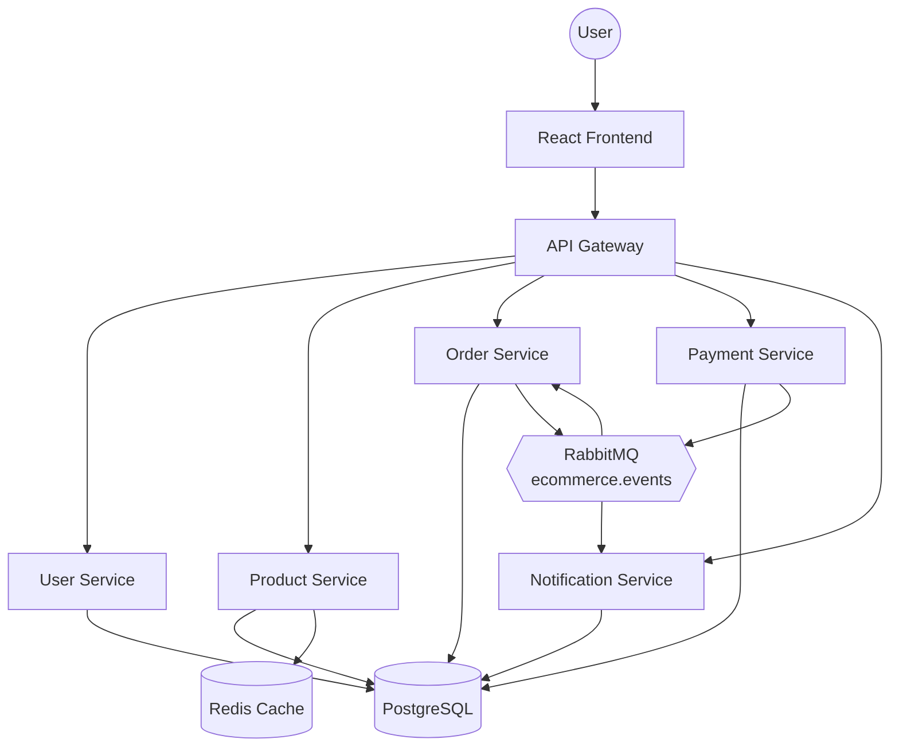
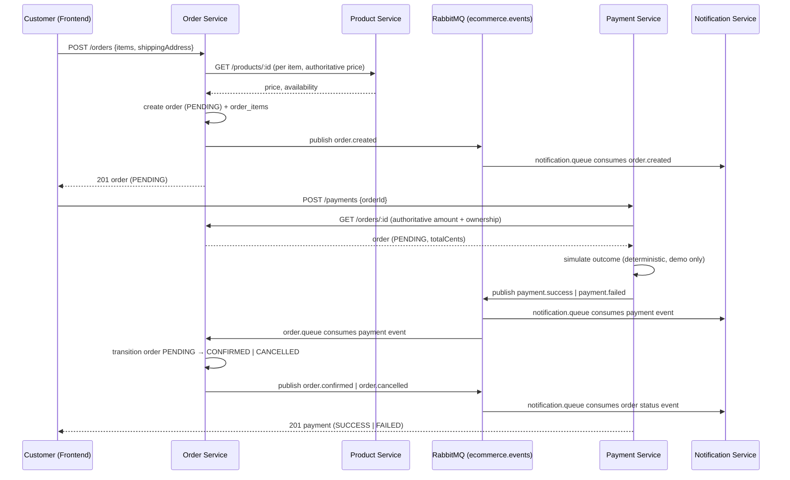

# Architecture Overview

## Scope

This repository builds and packages the **application only**: frontend,
API gateway, six backend microservices, database schema, and Docker
images. It intentionally contains no AWS/Terraform/Kubernetes
infrastructure — that is owned by a separate infrastructure repository.
Everything here must run locally via `docker compose up -d`.

## System diagram

## Why a shared PostgreSQL database

The spec's table list (`users`, `roles`, `products`, `categories`,
`inventory`, `orders`, `order_items`, `payments`, `notifications`,
`refresh_tokens`) is presented as one schema, not per-service schemas. For
this scope, a single shared PostgreSQL instance/database keeps local setup
and migrations simple while each service still only queries the tables it
owns. See [database/schema.sql](../../database/schema.sql).

## Event-driven flow: checkout → payment → confirmation

## RabbitMQ topology

- Exchange: `ecommerce.events` (topic, durable), plus a matching
  `ecommerce.events.dlx` dead-letter exchange.
- Queues: `notification.queue` (bound to all 6 order/payment event types),
  `order.queue` (bound to `payment.success`/`payment.failed`, drives order
  auto-confirmation/cancellation), `payment.queue` (bound to
  `order.created`, consumed by payment-service purely as an audit/
  observability hook — the primary payment flow stays synchronous via
  `POST /payments` per the spec's REST-only payment endpoints).
- Each queue has a companion `<queue>.retry` (5s TTL, dead-letters back to
  the main queue) and `<queue>.dlq`. A failed handler retries up to 3
  times, then is dead-lettered — never silently dropped. See
  [config/rabbitmq.js](../../services/order-service/src/config/rabbitmq.js)
  (duplicated per service that needs it).

## Service responsibility boundaries

- **api-gateway**: routing, edge JWT validation, rate limiting, CORS,
  security headers — never trusts a client-supplied price or ownership
  claim; that's the owning service's job.
- **order-service**: fetches product price from product-service rather
  than trusting the client; computes totals server-side.
- **payment-service**: fetches the order (amount, currency, owner) from
  order-service rather than trusting the client.
- This "ask the owning service" pattern is used consistently instead of a
  shared database read from an unrelated service, keeping ownership clear
  even though the underlying Postgres instance is physically shared.

## Frontend state

- `AuthContext`: JWT session (access + refresh tokens in `localStorage`),
  auto-refreshes an expired access token once via an axios interceptor.
- `CartContext`: client-side cart persisted to `localStorage`, converted
  to an order only at checkout.
- No Redux — Context API is sufficient at this scope.
